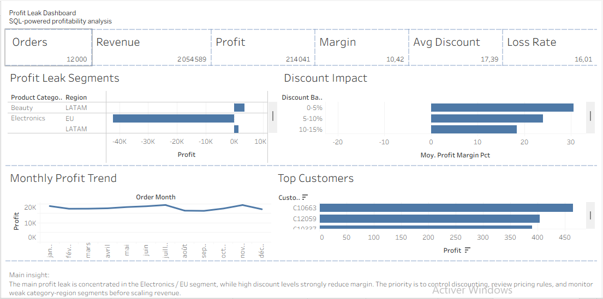

## 📊 Dashboard Preview



# 📊 E-Commerce Profit Leak Analysis

## 🧠 Business Context

Despite generating $2.05M in revenue, the company delivers only $214K in profit, resulting in a low overall margin of 10.42%.

This gap between revenue and profitability indicates significant margin erosion, likely driven by:

- aggressive discounting strategies
- inefficient regional performance
- cost structure imbalances

The objective of this project is to identify, quantify, and prioritize profit leakage sources, and provide actionable strategies to improve profitability.


## 🎯Objectives

- Identify loss-making segments across product categories and regions
- Analyze the impact of discounting on profitability
- Detect structural weaknesses in business performance
- Provide data-driven recommendations to restore margin


## 📂 Project Structure

```text
01_profit_leak_analysis/
├── data/
│   └── ecommerce_orders.csv
├── scripts/
│   ├── generate_dataset.py
│   └── analyze_profit_leaks.py
├── sql/
│   └── profit_analysis_queries.sql
├── outputs/
│   ├── ecommerce_orders_with_profit.csv
│   ├── profit_by_category.csv
│   ├── profit_by_region.csv
│   ├── discount_impact.csv
│   ├── top_10_profitable_customers.csv
│   ├── worst_loss_making_segments.csv
│   ├── profit_by_category.png
│   ├── profit_by_region.png
│   ├── discount_impact_on_margin.png
│   ├── top_10_profitable_customers.png
│   ├── worst_loss_making_segments.png
│   └── key_findings_summary.json
└── requirements.txt


## 📊 Dataset Overview

Total Orders: 12,000
Revenue: $2,054,589.16
Profit: $214,040.75
Overall Margin: 10.42%
Date Range: January 2024 → December 2025
Data Dimensions
Product Category
Region
Customer ID
Order Date
Discount
Columns
order_id
customer_id
product_category
region
order_date
revenue
cost
discount


## 🔍 Analytical Approach

The analysis focuses on identifying profitability drivers using:

Profit calculation: profit = revenue - cost
Segment-level performance analysis by category and region
Discount impact analysis
Identification of negative-profit segments
Concentration of profit leakage


## 🚨 Key Insights

1. Critical Profit Leak: Electronics in EU

The Electronics category in the EU is the largest source of profit leakage.

Profit: -$42,103.66
Margin: -17.53%
Average Discount: 30.25%

This segment alone erodes nearly 20% of total company profit, making it the highest-priority issue to fix.

2. Structural Weakness in the EU Market

The EU region generates strong revenue but very weak profitability.

Revenue: $533,005.54
Profit: $5,890.14
Margin: 1.11%

Compared with regions performing around 15% margin, the EU market appears structurally weak.

This may indicate:

excessive discounting
misaligned pricing strategy
higher cost-to-serve
weaker margin control
3. Discounting Strategy is Destroying Profitability

High discounts are not generating profitable growth.

Orders with discount ≥ 25% generated -$40,234.94 profit
Orders with discount < 15% generated $166,114.56 profit

This shows that aggressive discounting is creating revenue volume but destroying margin.

4. Margin Collapses as Discount Levels Increase

Profitability decreases sharply as discounts increase.

0–5% discount: 34.84% margin
30–45% discount: -14.75% margin

This is a major warning sign: the company is selling more, but not protecting profitability.

5. Secondary Profit Leak: Home & Kitchen in LATAM

The second major loss-making segment is Home & Kitchen in LATAM.

Profit: -$3,983.51
Margin: -8.37%

This suggests that the issue is not only discounting, but also possibly:

high logistics cost
weak supplier margins
inefficient cost structure
unsuitable pricing strategy for the region

6. High Share of Loss-Making Orders

A total of 16.01% of orders are loss-making.

This indicates weak pricing governance and a lack of automated margin protection rules.

The company should not allow such a high percentage of transactions to generate negative profit unless there is a clear strategic reason, such as customer acquisition or retention.

## 🧠 Strategic Diagnosis

The company faces three major structural problems:

1. Uncontrolled Discounting

Discounts are being applied without enough margin protection.

The data shows that deep discounts can turn revenue into losses.

2. Regional Profitability Imbalance

The EU region has high revenue but almost no margin.

This suggests that revenue growth alone is not enough. The company needs to optimize pricing, costs, and promotional strategy by region.

3. Lack of Profitability Monitoring

The company needs better visibility on:

which segments lose money
which discount levels destroy margin
which regions underperform
which customers or categories generate value

Without this monitoring, management may continue pushing sales while profitability deteriorates.


## What I Would Present to a Business Team

Problem:
The company generates strong revenue but loses profitability because some segments destroy margin.

Finding:
Electronics in EU generates a negative margin of -17.53%, and orders with discounts above 25% generate negative total profit.

Decision:
Introduce margin-based discount guardrails and review EU pricing strategy.

Expected Impact:
Reduce loss-making orders, protect margins, and improve profit without necessarily increasing revenue.


## 💡 Recommendations

1. Implement Margin-Based Discount Guardrails

The company should define maximum discount thresholds by product category and region.

For example:

lower discount caps for Electronics in EU
stricter approval process for discounts above 25%
automatic alerts when projected margin becomes negative

This would prevent campaigns from generating unprofitable revenue.

2. Shift from Volume-Driven Growth to Profit-Driven Growth

The company should stop using blanket discounts as the default growth strategy.

Instead, it should use:

targeted promotions
loyalty-based offers
customer segmentation
margin-aware campaigns

The objective should be to grow profit, not only revenue.

3. Fix the EU Pricing Model

The EU market needs immediate attention because it has strong revenue but very weak profitability.

Recommended actions:

reduce excessive discounting
review pricing strategy
analyze logistics and operational costs
monitor category-level margins weekly

4. Optimize Home & Kitchen in LATAM

For Home & Kitchen in LATAM, the company should investigate whether losses come from:

supplier cost
shipping cost
fulfillment cost
excessive promotions

Recommended actions:

renegotiate supplier contracts
improve logistics efficiency
limit discount exposure until margin improves

5. Deploy a Profit Leak Monitoring Dashboard

Management should monitor profit leaks every week using a dashboard tracking:

total revenue
total profit
overall margin
margin by region
margin by product category
discount-band profitability
top loss-making segments
percentage of loss-making orders

This would allow the company to detect margin problems early instead of reacting after losses accumulate.


## 📈  Business Impact

By addressing these issues, the company could:

recover lost margin
reduce loss-making transactions
improve profitability without needing more revenue
build a more sustainable growth model
make promotions more efficient

The biggest opportunity is not simply to increase sales, but to make current sales more profitable.


## ⚙️ How to Run the Project

### 1. Install dependencies
```bash
pip install -r requirements.txt
```

### 2. Generate the dataset
```bash
python scripts/generate_dataset.py
```

### 3. Run the analysis
```bash
python scripts/analyze_profit_leaks.py
```

### 4. Review outputs
The results are saved in the `outputs/` folder.

This includes:

cleaned dataset with profit column
profit by category
profit by region
discount impact analysis
top 10 profitable customers
worst loss-making segments
charts and visualizations
key findings summary
SQL Analysis

The file sql/profit_analysis_queries.sql contains SQL queries to reproduce the main business analysis.

It includes:

total profit calculation
profit by category
profit by region
discount impact by discount band
loss-making segment analysis


Tools Used

Python
pandas
matplotlib
SQL
CSV analysis
Business analytics
Data storytelling


## 🎤 Interview Explanation

If asked to explain this project in an interview, I would say:

I analyzed an e-commerce dataset to understand why strong revenue was not translating into strong profitability.

I calculated profit at order level, then analyzed profitability by product category, region, and discount level.

The main finding was that Electronics in the EU was the largest profit leak, with negative margin caused by aggressive discounting.

I also found that orders with discounts above 25% generated negative total profit, while low-discount orders remained profitable.

Based on this, I recommended margin-based discount guardrails, a review of EU pricing strategy, and a weekly profit leak monitoring dashboard.


## 🚀 Skills Demonstrated

This project demonstrates:

data cleaning
profitability analysis
SQL querying
business KPI analysis
discount impact analysis
segmentation of loss-making areas
data visualization
business recommendations
analytical storytelling


## ✅ Conclusion

This analysis shows that the company’s profitability problem is not caused by a lack of revenue.

The real issue is that some segments generate high sales volume while destroying margin.

The highest-priority problem is Electronics in EU, followed by Home & Kitchen in LATAM and broader discounting inefficiencies.

By controlling discounts, monitoring margins, and improving regional pricing strategies, the company can increase profitability without necessarily increasing revenue.